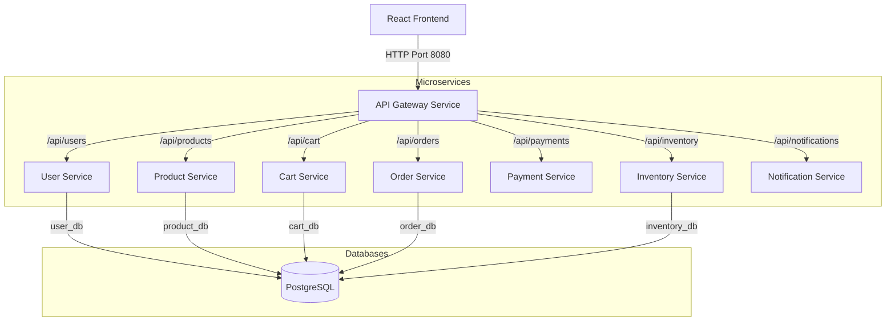

# E-Commerce Microservices DevOps Sandbox

Welcome to the **E-Commerce Microservices DevOps Sandbox**, a premium, full-fledged Java Spring Boot and React.js application designed specifically as an educational platform for learning modern software architecture, build systems (Maven and Gradle), Docker containerization, Kubernetes orchestration, and CI/CD pipelines.

This repository implements an Amazon-like shopping site where multiple independent microservices collaborate to fulfill requests from a responsive React web frontend.

---

## 🏗️ Architecture Overview

The system is designed with a decentralized, database-per-service pattern, exposing REST APIs orchestrated through an API Gateway:



### Bounded Contexts & Services
1. **API Gateway (Maven):** Single entry point mapping paths to microservices. Implemented with Spring Cloud Gateway; controls global CORS.
2. **User Service (Maven):** Registers/authenticates users. Computes JWT tokens using SHA-256 keys.
3. **Product Service (Gradle):** Serves catalog data, manages products, and performs product searches. Automatically seeds sample products on startup.
4. **Cart Service (Gradle):** Aggregates shopping cart items per user.
5. **Order Service (Maven):** Orchestrates the checkout process. Coordinates stock allocation, processes credit card charges, wipes carts, and schedules emails.
6. **Payment Service (Gradle):** Processes fake credit card requests. Succeeds by default, or fails if the card number ends with `0000` (for testing rollback scenarios).
7. **Inventory Service (Maven):** Manages items in stock. Deducts quantities on successful checkouts.
8. **Notification Service (Gradle):** Streams and logs order emails to console outputs and stores histories in memory.

---

## 🛠️ Build Systems: Maven vs Gradle

This codebase mixes both build systems to demonstrate how pipeline automation handles diverse compilation contexts:

* **Maven Services (`pom.xml`):**
  * Built using `mvn clean package`.
  * Standard configurations are declared in `pom.xml`, inheritance is managed via the Spring Boot Starter Parent.
  * Plugins like `spring-boot-maven-plugin` packages code into a fat bootable jar.

* **Gradle Services (`build.gradle`):**
  * Built using `./gradlew build` (or `gradle build`).
  * Configurations are declared in `build.gradle` using a clean, Groovy-based DSL.
  * Dependencies and plugins are loaded from Maven Central, caching artifacts inside the user's home `.gradle/` folder for fast build times.

---

## 🔄 Distributed Order Transaction Flow

When a user clicks "Submit Order & Pay" on the React checkout page, the following distributed transaction flow takes place:

```
  React Frontend             Order Service            Inventory Service           Payment Service         Notification Service
        |                          |                          |                          |                         |
        |---- POST /api/orders --->|                          |                          |                         |
        |                          |---- POST /reduce ------->|                          |                         |
        |                          |<--- 200 OK (Reduced) ----|                          |                         |
        |                          |                                                     |                         |
        |                          |---- POST /process --------------------------------->|                         |
        |                          |<--- 200 OK (Paid, Txn ID) --------------------------|                         |
        |                          |                                                                               |
        |                          |---- POST /notifications ----------------------------------------------------->|
        |                          |<--- 200 OK -------------------------------------------------------------------|
        |<--- 201 Created ---------|
```

---

## 🐳 Running Locally with Docker Compose

Running the entire stack requires Docker and Docker Compose:

### 1. Build and run all services
From the root directory, execute:
```bash
docker-compose up --build -d
```
This command performs multi-stage Docker builds on all 8 backend microservices and the React frontend, initializing a PostgreSQL container in the background.

### 2. Verify Database Initialization
The PostgreSQL container mounts `./db-init/init-databases.sql` to initialize isolated schemas:
* `user_db`
* `product_db`
* `cart_db`
* `order_db`
* `inventory_db`

### 3. Open the Application
Navigate to `http://localhost:3000` in your browser.
* Browse products, search, and register a user.
* Add items to cart.
* Perform checkout. Open terminal logs (`docker logs -f notification-service`) to inspect the fake emails.
* Test payment failure: checkout using a credit card number ending in `0000`.

---

## ☸️ Deploying to Kubernetes

All manifests are located in the `k8s/` folder. They deploy the applications into a dedicated namespace using ConfigMaps for service endpoints and Secrets for sensitive credentials.

### 1. Initialize namespace and secrets
```bash
kubectl apply -f k8s/namespace.yml
kubectl apply -f k8s/configmap-secret.yml
kubectl apply -f k8s/postgres-db.yml
```

### 2. Build local images inside minikube (optional/local testing)
If testing locally in Minikube, switch your shell to use Minikube's Docker daemon so images are visible:
```bash
eval $(minikube docker-env)
# Build all backend and frontend services, e.g.:
docker build -t api-gateway:latest ./api-gateway
docker build -t user-service:latest ./user-service
docker build -t product-service:latest ./product-service
docker build -t cart-service:latest ./cart-service
docker build -t order-service:latest ./order-service
docker build -t payment-service:latest ./payment-service
docker build -t inventory-service:latest ./inventory-service
docker build -t notification-service:latest ./notification-service
docker build -t frontend:latest ./frontend
```

### 3. Deploy the applications
```bash
kubectl apply -f k8s/
```
This will deploy:
* All 8 microservices and the React UI.
* Ingress resources routing `/` to the frontend and `/api/` to the gateway.

---

## 🚀 CI/CD Pipelines

The codebase includes configuration templates for major CI/CD orchestrators:
1. **GitHub Actions (`.github/workflows/ci.yml`):** Automatically triggers on pushes to main. Builds Maven & Gradle applications, runs unit tests, and provides placeholders for security checks, SonarQube, and Kubernetes deployment.
2. **GitLab CI (`.gitlab-ci.yml`):** Runs multistage pipelines matching dependency caching patterns.
3. **Jenkinsfile:** Orchestrates build stages in a declarative syntax using shared pipeline libraries.

---

## 📊 Monitoring with Prometheus & Actuator

Each Spring Boot microservice has Actuator enabled, exporting raw Prometheus-formatted JVM, HTTP traffic, and DB metrics.
* Scrape configuration is managed in [prometheus.yml](file:///C:/Users/dheer/.gemini/antigravity/scratch/ecommerce-microservices/monitoring/prometheus.yml).
* Access metrics by curling any service endpoint directly: `http://localhost:[port]/actuator/prometheus` (e.g. `8080` for Gateway, `8081` for User, etc.).
